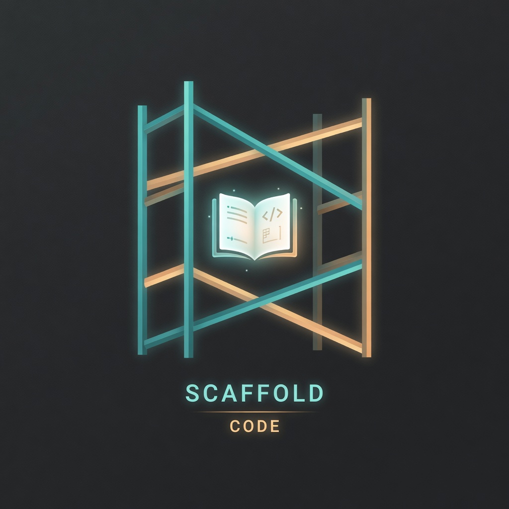

<p align="center">
  
</p>

# scaffold-code

Operating rails for an AI coding agent working a single project. Drop a `.scaffold/` directory
into any repo and every session starts oriented, works inside the project's standards, and
leaves a memory the next session picks up. Works with Claude Code, Codex, Pi, and opencode;
ports to anything that can read a markdown file.

## Why

A `CLAUDE.md` states rules at rest. It cannot sequence behavior, enforce a gate, or remember
what happened last week. scaffold-code adds the missing procedural layer: a boot routine, a
per-task loop, and project memory. The substance is plain markdown, so the rails are
runtime-agnostic: the agent is the runtime, the files are the program (pure-agent +
cookbook-on-demand, after `disler/the-library`).

## Quick start

Once per machine:

```bash
curl -fsSL https://raw.githubusercontent.com/1337hero/scaffold-code/main/install.sh | bash
```

This clones the repo to `~/.scaffold-code` (or uses an existing checkout), puts `scaffold` on
your PATH, and runs `scaffold setup`, which installs adapters into every supported agent found
on the machine. Codex users: run `/hooks` once afterward and trust the scaffold entries.

Per project:

```bash
scaffold init <repo>
```

Then fill in the two files the agent will live by: `.scaffold/rails/standards.md` (your
project's standards) and `.scaffold/memory/STATE.md` (where the project stands). That's the
whole setup. The full walkthrough, with examples of both files and a narrated session, is in
[docs/how-to.md](docs/how-to.md).

## What a session looks like

Adapters inject `.scaffold/BOOT.md` at session start (the keystone: the agent never starts
cold). BOOT enforces one loop:

```
Session boot:  ORIENT      (once)
Per task:      FRAME → WORK → REVIEW
Session end:   CLOSE OUT   (once, or when you hand back a question)
```

The agent orients from `memory/STATE.md` and the session log, works each task on a branch, and
closes out by writing a dated log entry. Continuity across sessions and across agents comes
from that memory, not from any one tool's context window.

## Enforcement lives in the environment

Rails are read and trusted by default. Where a rule can be mechanized, it is enforced at the
boundary of reality, never by parsing what an agent says it is doing:

- **Push protection.** A git `pre-push` hook blocks pushes to the default branch from any
  runtime, agent, or phrasing. `.scaffold/`-only memory maintenance is exempt.
- **Closeout gate.** `cookbook/closeout-check.sh` passes untouched when nothing shipped and
  fails loudly on code sitting on the default branch, a log entry older than the last code
  change, or a secret in the diff. Adapters relay its verdict at session end and block or
  nudge the agent until closeout is done.
- **Escape hatch.** `SCAFFOLD_OFF=1` turns everything off for humans.

Judgment rails (derive-don't-ask, stay-in-scope) are deliberately not mechanized; that
produces theater. Details in [docs/closeout-gate.md](docs/closeout-gate.md).

## Supported runtimes

| Runtime | Injection | Gate relay |
|---|---|---|
| Claude Code | `SessionStart` hook | `Stop` hook blocks stopping |
| Codex | `SessionStart` hook | `Stop` hook blocks stopping |
| Pi | `before_agent_start` extension | `agent_end` nudges once, then warns the human |
| opencode | system-prompt transform plugin | `session.idle` nudges once, then warns the human |

Adapters install once per machine (`scaffold setup`) and activate only in repos that contain
`.scaffold/BOOT.md`. They carry no rail logic of their own. For an unsupported runtime, point
the agent at `.scaffold/BOOT.md` however you can; the pre-push hook and closeout gate work
with no adapter at all. Per-runtime detail: [docs/adapters.md](docs/adapters.md).

## Layout

| Path | What it is |
|---|---|
| `template/.scaffold/` | Canonical deployed tree, nested so this source repo does not activate its own hooks. |
| `BOOT.md` | Read first, every session. Hard rails, the two imperatives, derive-don't-ask. |
| `rails/standards.md` | This project's standards, the gates the agent enforces. Project-owned. |
| `cookbook/` | Procedures loaded on demand: orient, the per-task loop, closeout. |
| `memory/STATE.md` | Living "where the project stands." Project-owned. |
| `memory/log/` | Dated session closeouts. Project-owned. |
| `hooks/pre-push` | Environment-level push protection, installed into `.git/hooks/`. |
| `adapters/` | Per-runtime injection: Claude Code, Codex, Pi, opencode. |

Engine files (`BOOT.md`, `cookbook/`, the hook) are stock, stamped with a `VERSION`, and
refreshed by `scaffold update`. `rails/` and `memory/` belong to the project and are never
overwritten. `scaffold status` shows drift against the canonical engine.

## Documentation

- [How-to: set it up and what using it looks like](docs/how-to.md)
- [Architecture and mental model](docs/architecture.md)
- [CLI reference](docs/cli.md)
- [Adapters](docs/adapters.md)
- [The closeout gate](docs/closeout-gate.md)
